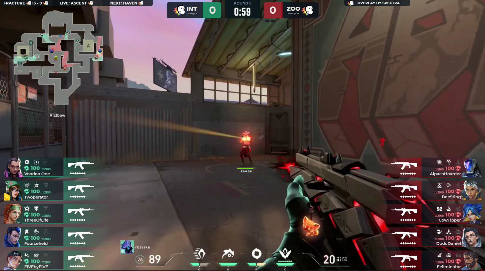

# ValoSpectra - Frontend Overlay

[](https://www.gnu.org/licenses/gpl-3.0)


ValoSpectra is a comprehensive Valorant Tournament Overlay solution that enables tournament organizers to display game information like weapons, abilities, credits, and more with just a single spectator running the client software.



## Overview

ValoSpectra creates a professional esports viewing experience by providing real-time game state visualization. The system consists of three main components:

### The Ecosystem

- **[Spectra Client](https://github.com/ValoSpectra/Spectra-Client)**  
  Running on a single in-game observer computer, this software captures and forwards game data from Overwolf.

- **[Spectra Server](https://github.com/ValoSpectra/Spectra-Server)**  
  Ingests data from the client to reconstruct an accurate game state representation.

- **[Spectra Frontend](https://github.com/ValoSpectra/Spectra-Frontend)** (This Repository)  
  The overlay interface that receives game state updates every 100 milliseconds and presents them in a visually appealing format.

## Features

- Player loadouts and economy
- Real-time health and shield displays
- Ability usage tracking
- Spike plant and defuse timers
- Team scores and match statistics
- Support for tournament branding and sponsorship displays
- Customizable team colors and logos

## Deployment Options

### Using Docker Compose (Recommended)

1. Create a directory for your deployment and a config folder inside it:

```bash
mkdir -p spectra-frontend/config
cd spectra-frontend
```

2. Create a `docker-compose.yml` file:

```yaml
---
services:
  valo-spectra-frontend:
    image: "ghcr.io/valospectra/overlay"
    ports:
      - "3000:80"
    volumes:
      - ./config:/usr/share/nginx/html/assets/config/
```

3. In the `config` folder, create a file named `config.json`:

```json
{
  "serverEndpoint": "http://localhost:5200",
  "redirectUrl": "https://valospectra.com",
  "sponsorImageUrls": ["/assets/misc/logo.webp"],
  "sponsorImageRotateSpeed": 5000,
  "attackerColorPrimary": "#b82e3c",
  "attackerColorSecondary": "#ff4557",
  "attackerColorShieldCurrency": "#ff838f",
  "defenderColorPrimary": "#25ac79",
  "defenderColorSecondary": "#61eab6",
  "defenderColorShieldCurrency": "#61eab6"
}
```

4. Update the `serverEndpoint` to point to your Spectra Server instance.

5. Start the frontend:

```bash
docker compose up -d
```

The overlay will be accessible at `http://localhost:3000` by default.

### Development Setup

If you want to run the project for development:

1. Clone the repository
2. Install dependencies:

   ```bash
   corepack enable
   yarn install
   ```

3. Start the development server:

   ```bash
   yarn start
   ```

## Configuration

The `config.json` file supports the following options:

| Option                        | Description                                     |
| ----------------------------- | ----------------------------------------------- |
| `serverEndpoint`              | URL of your Spectra Server                      |
| `redirectUrl`                 | Redirect destination for the root path          |
| `sponsorImageUrls`            | Array of image paths for sponsor rotation       |
| `sponsorImageRotateSpeed`     | Sponsor image rotation interval in milliseconds |
| `attackerColorPrimary`        | Primary color for attacking team                |
| `attackerColorSecondary`      | Secondary color for attacking team              |
| `attackerColorShieldCurrency` | Shield and currency color for attacking team    |
| `defenderColorPrimary`        | Primary color for defending team                |
| `defenderColorSecondary`      | Secondary color for defending team              |
| `defenderColorShieldCurrency` | Shield and currency color for defending team    |

For the most up-to-date configuration options, check `src/app/shared/config.ts`.

## Usage

The overlay provides multiple modes accessible via different endpoints:

- `/overlay` - Standard overlay
- `/overlay/minimal` - Minimal overlay with less information
- `/agent-select` - Agent selection screen
- `/autoswitch` - Automatic switch between agent select and game overlay

You will have to append a `?groupCode=YOURCODE` parameter to connect to a specific match group.

## Contributing

Contributions are welcome! Feel free to open issues or submit pull requests.

## License

This project is licensed under the GNU General Public License v3.0 - see the [LICENSE](LICENSE) file for details.

## Disclaimer

Spectra-Client isn't endorsed by Riot Games and doesn't reflect the views or opinions of Riot Games or anyone officially involved in producing or managing Riot Games properties. Riot Games, and all associated properties are trademarks or registered trademarks of Riot Games, Inc.
